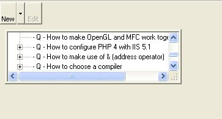

<div align="center">

## Make a Sizeable Control


</div>

### Description

This code allows you to make a non-sizeable control in VB 6.0, to a sizeable control.
 
### More Info
 
X as Control

Y as Form

Thanks to Randy Birch, for most of the code, I encapsulated it as a class, hence:

'to use the class, create a Form1 and Textbox1

Dim clsA as clsUser

Set clsA = New clsUser

clsA.SetControlResize(Textbox1, Me)

Set clsA = Nothing


<span>             |<span>
---                |---
**Submitted On**   |
**By**             |[D Lee](https://github.com/Planet-Source-Code/PSCIndex/blob/master/ByAuthor/d-lee.md)
**Level**          |Advanced
**User Rating**    |4.7 (14 globes from 3 users)
**Compatibility**  |VB 6\.0
**Category**       |[Windows API Call/ Explanation](https://github.com/Planet-Source-Code/PSCIndex/blob/master/ByCategory/windows-api-call-explanation__1-39.md)
**World**          |[Visual Basic](https://github.com/Planet-Source-Code/PSCIndex/blob/master/ByWorld/visual-basic.md)
**Archive File**   |[](https://github.com/Planet-Source-Code/d-lee-make-a-sizeable-control__1-49510/archive/master.zip)

### API Declarations

```
Option Explicit
'windows constants
Private Const SWP_DRAWFRAME As Long = &H20
Private Const SWP_NOMOVE As Long = &H2
Private Const SWP_NOSIZE As Long = &H1
Private Const SWP_NOZORDER As Long = &H4
Private Const SWP_FLAGS As Long = SWP_NOZORDER Or SWP_NOSIZE Or _
                 SWP_NOMOVE Or SWP_DRAWFRAME
Private Const GWL_STYLE As Long = (-16)
Private Const WS_THICKFRAME As Long = &H40000
Private Declare Function GetWindowLong Lib "user32" _
  Alias "GetWindowLongA" _
 (ByVal hwnd As Long, _
  ByVal nIndex As Long) As Long
Private Declare Function SetWindowLong Lib "user32" _
  Alias "SetWindowLongA" _
 (ByVal hwnd As Long, _
  ByVal nIndex As Long, _
  ByVal dwNewLong As Long) As Long
Private Declare Function SetWindowPos Lib "user32" _
 (ByVal hwnd As Long, _
  ByVal hWndInsertAfter As Long, _
  ByVal X As Long, _
  ByVal Y As Long, _
  ByVal cx As Long, _
  ByVal cy As Long, _
  ByVal wFlags As Long) As Long
```


### Source Code

```
Public Sub SetControlResize(X As Control, Y As Form)
  Dim style As Long
 'get the current style attributes for the control
  style = GetWindowLong(X.hwnd, GWL_STYLE)
 'modify the style to show the sizing frame
  style = style Or WS_THICKFRAME
 'set the control to the chosen style
 If style Then
  Call SetWindowLong(X.hwnd, GWL_STYLE, style)
  Call SetWindowPos(X.hwnd, Y.hwnd, 0, 0, 0, 0, SWP_FLAGS)
 End If
End Sub
```

